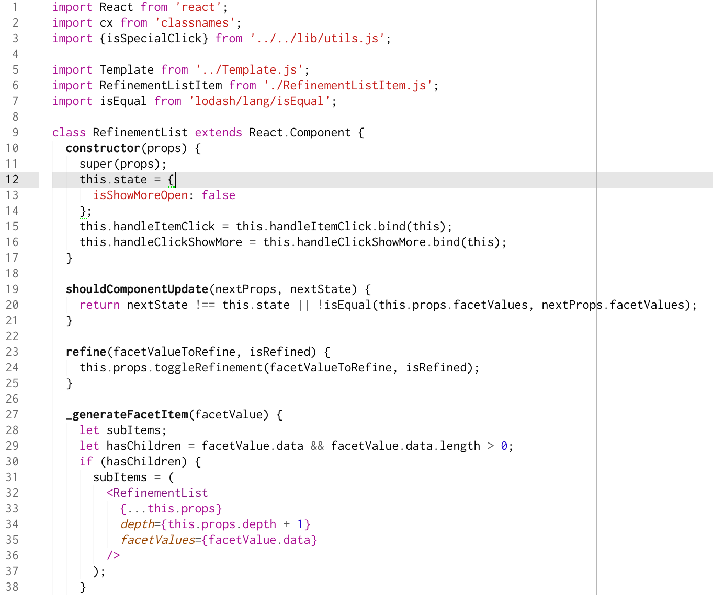

# chrome-devtools-syntax

A light syntax theme for Atom reproducing the chrome devtools colors.

It's a modified port of Austin Cummings's [Chrome DevTools theme](http://colorsublime.com/theme/Chrome_DevTools) for Sublime Text 2.

I have been using this syntax theme for years now.

